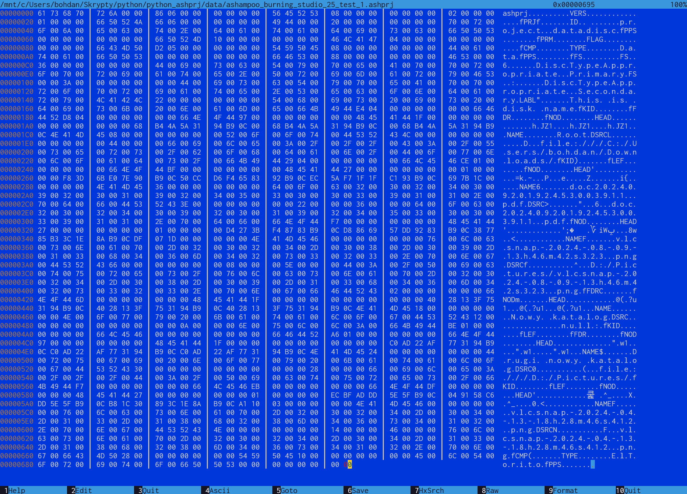

# Python *.ashprj file support

Attempt to understand Ashampoo Burning Stutio file format *.ashprj

## Purpose and reason

I archive large amounts of data on DVDs and BRs. I use various tools to split the data onto separate discs, and none of them are perfect.

I do not want to use tools such as RAR, ZIP or to create ISO disk images because it causes unnecessary data processing, I want to use project files of CD/DVD/BR authoring programs.

In the past [I used a simple script that I wrote years ago in php](https://github.com/bohdanbobrowski/k3b_backuptool), which divided data according to a set size limit (e.g. 4GB) and created K3B program files from them (these were relatively simple XML). However, the sad reality forced me to switch to Windows...

### My goal

I want to write a similar script in python that will split my data into project files and allow me to record them on Windows.

### Comparison of different programs and their file types for Windows

I am currently testing various CD/DVD/BR burning files on this system - unfortunately K3B does not work on this system - and unfortunately I still cannot find a suitable alternative.

#### Free

###### [BurnAware Free](https://www.burnaware.com)

Advantages:
- project is active, commercial version available and not overpriced
- file format is based on XML: [burnaware_free.bafl](data%2Fburnaware_free.bafl)

###### [ImgBurn](https://www.imgburn.com)

Advantages:
- file format looks simple: [imgburn_test_1.ibb](data%2Fimgburn_test_1.ibb)

Disadvantages
- project seems to be abandoned ([2.5.8.0 was release in June on 2013](https://www.imgburn.com/index.php?act=changelog))

#### Commercial

As far as I know, none of the free programs for Windows allow you to split data onto multiple discs the way I would expect. Of all the commercial products, I had the opportunity to try two:

###### Ashampoo Burning Studio 25

Advantages:
- the license is probably the cheapest
- it allows you to split data onto discs but it doesn't work perfectly

Disadvantages:
- it mixes files between discs instead of splitting them alphabetically which makes it difficult to find a file on a disc
- if something goes wrong during recording it is difficult to resume the process (I had this happen when recording the seventh CD out of ten)
- the file is saved in binary format, I tried to understand its structure, but it's probably a waste of time and it would be better to write something for CyberLink or another program:

###### Cyberlink Power2GO 8

Advantages:
- it's was added to my BR recorded
- file format is based on XML

Disadvantages:
- version i've got is bit old (2015)
- it does not support splitting data between disks by default
- UI does not support HDPI!

